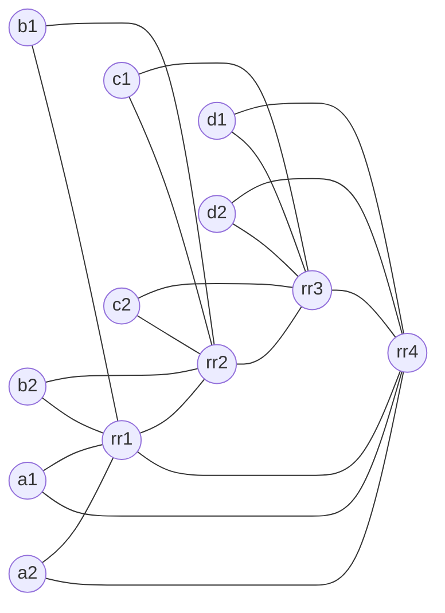

# BGP ORR Part 3: ORR + ADD-PATH (cRPD + containerlab)

This lab demonstrates BGP Optimal Route Reflection (ORR) with four regional route reflector (RR) clusters **plus BGP ADD-PATH**. Each cluster has two clients. The topology uses iBGP everywhere and IS-IS as the underlay IGP. ORR is configured per region using `optimal-route-reflection` with `igp-primary` and `igp-backup`. ADD-PATH is enabled between RRs and from RRs to clients (up to 3 paths).

The key idea is to show how ORR lets an RR select a best path based on the IGP view of a client location, not the RR's own IGP perspective.

## Topology summary

- 4 regions: A, B, C, D
- 4 RRs: `rr1`–`rr4`
- 8 clients: `a1 a2 b1 b2 c1 c2 d1 d2`
- iBGP between each RR and its two clients
- iBGP full mesh between RRs
- IS-IS L2 across all nodes
- ORR enabled on each RR for its regional client group
- ADD-PATH enabled (up to 3 paths) between RRs and to clients

Clients are dual-homed into the IGP (to their regional RR and the adjacent RR) to create different IGP viewpoints between the RR and the client group. This allows ORR to actually change the chosen egress for a shared prefix.

## Topology diagram



## What ORR does in this lab

Two clients originate the same prefix `198.51.100.0/24`:

- `c1` (Region C)
- `d1` (Region D)

Without ORR, `rr1` would select the best path based on its own IGP distances. With ORR enabled and the `igp-primary` set to `a1`, `rr1` selects the best path based on `a1`'s IGP view. Because `a1` is closer (IGP-wise) to Region D in this lab, ORR causes `rr1` to reflect the `d1` path to its clients, even though `rr1` itself is closer to `c1`.

## ORR fundamentals (quick refresher)

- ORR improves RR path selection by using a client's IGP view instead of the RR's local IGP view.
- ORR is enabled per BGP peer group with `optimal-route-reflection`.
- A client group should share similar IGP topology.
- You set one client as `igp-primary` and optionally an `igp-backup`.
- ORR only works when the BGP next-hop is resolved in the IGP (inet.0), not when MPLS/LDP/RSVP resolves the next-hop.

## Files

- `bgp-orr-4rr.clab.yml`: containerlab topology
- `configs/`: startup configs for each node

## Prereqs

1. Linux host with Docker installed
2. containerlab installed
3. cRPD image loaded into Docker

This lab uses `crpd:24.4R2-S3.5` in the topology file. If you have a different stable tag, update the `image:` field in `bgp-orr-4rr.clab.yml`.

## cRPD interface and IS-IS notes (important)

These are cRPD-specific behaviors that will break IS-IS if you use Junos/vMX-style config:

- Data-plane interfaces are `eth1`, `eth2`, ... (not `ge-0/0/x`).
- IS-IS is configured on the parent interface, not a unit:
  - `set protocols isis interface eth1 point-to-point`
  - `set protocols isis interface eth1 level 2 metric 10`
- `family iso` is not supported on `eth*` in this cRPD build. Only keep the NET under `protocols isis net` and `lo0.0` passive.

If you see no IS-IS adjacencies, first confirm you are not using `ethX.0` in IS-IS or `family iso` on `eth*`.

## Deploy

```bash
sudo containerlab deploy -t bgp-orr-4rr.clab.yml
```

Check that all nodes are running:

```bash
containerlab inspect -t bgp-orr-4rr.clab.yml
```

## Validate IGP

On any node (example `rr1`):

```bash
docker exec -it clab-bgp-orr-4rr-rr1 cli
root@rr1> show isis adjacency
Interface             System         L State         Hold (secs) SNPA
eth1                  rr2            2  Up                    23
eth2                  rr4            2  Up                    26
eth3                  a1             2  Up                    21
eth4                  a2             2  Up                    18
eth5                  b1             2  Up                    23
eth6                  b2             2  Up                    23

root@rr1> show route protocol isis

inet.0: 49 destinations, 50 routes (49 active, 0 holddown, 0 hidden)
+ = Active Route, - = Last Active, * = Both

10.0.0.2/32        *[IS-IS/18] 01:23:36, metric 10
                       to 172.16.0.19 via eth5
                    >  to 172.16.0.1 via eth1
                       to 172.16.0.23 via eth6
10.0.0.3/32        *[IS-IS/18] 01:23:36, metric 20
                       to 172.16.0.19 via eth5
                       to 172.16.0.1 via eth1
                    >  to 172.16.0.9 via eth3
                       to 172.16.0.13 via eth4
                       to 172.16.0.23 via eth6
10.0.0.4/32        *[IS-IS/18] 01:23:36, metric 10
                       to 172.16.0.9 via eth3
                    >  to 172.16.0.13 via eth4
10.0.1.1/32        *[IS-IS/18] 01:23:36, metric 5
                    >  to 172.16.0.9 via eth3
10.0.1.2/32        *[IS-IS/18] 01:23:36, metric 5
                    >  to 172.16.0.13 via eth4
10.0.1.11/32       *[IS-IS/18] 01:23:36, metric 5
                    >  to 172.16.0.19 via eth5
10.0.1.12/32       *[IS-IS/18] 01:23:36, metric 5
                    >  to 172.16.0.23 via eth6
10.0.1.21/32       *[IS-IS/18] 01:23:36, metric 15
                       to 172.16.0.19 via eth5
                       to 172.16.0.1 via eth1
                    >  to 172.16.0.23 via eth6
10.0.1.22/32       *[IS-IS/18] 01:23:36, metric 15
                       to 172.16.0.19 via eth5
                       to 172.16.0.1 via eth1
                    >  to 172.16.0.23 via eth6
10.0.1.31/32       *[IS-IS/18] 01:23:36, metric 15
                    >  to 172.16.0.9 via eth3
                       to 172.16.0.13 via eth4
10.0.1.32/32       *[IS-IS/18] 01:23:36, metric 15
                       to 172.16.0.9 via eth3
                    >  to 172.16.0.13 via eth4
172.16.0.2/31      *[IS-IS/18] 01:23:36, metric 20
                       to 172.16.0.19 via eth5
                       to 172.16.0.1 via eth1
                    >  to 172.16.0.23 via eth6
172.16.0.4/31      *[IS-IS/18] 01:23:36, metric 60
                       to 172.16.0.9 via eth3
                    >  to 172.16.0.13 via eth4
172.16.0.10/31     *[IS-IS/18] 01:23:36, metric 10
                    >  to 172.16.0.9 via eth3
172.16.0.14/31     *[IS-IS/18] 01:23:36, metric 10
                    >  to 172.16.0.13 via eth4
172.16.0.16/31     *[IS-IS/18] 01:23:36, metric 10
                    >  to 172.16.0.19 via eth5
172.16.0.20/31     *[IS-IS/18] 01:23:36, metric 10
                    >  to 172.16.0.23 via eth6
172.16.0.24/31     *[IS-IS/18] 01:23:36, metric 20
                    >  to 172.16.0.19 via eth5
                       to 172.16.0.1 via eth1
                       to 172.16.0.23 via eth6
172.16.0.26/31     *[IS-IS/18] 01:23:36, metric 15
                       to 172.16.0.19 via eth5
                    >  to 172.16.0.1 via eth1
                       to 172.16.0.23 via eth6
172.16.0.28/31     *[IS-IS/18] 01:23:36, metric 20
                    >  to 172.16.0.19 via eth5
                       to 172.16.0.1 via eth1
                       to 172.16.0.23 via eth6
172.16.0.30/31     *[IS-IS/18] 01:23:36, metric 15
                    >  to 172.16.0.19 via eth5
                       to 172.16.0.1 via eth1
                       to 172.16.0.23 via eth6
172.16.0.32/31     *[IS-IS/18] 01:23:36, metric 15
                       to 172.16.0.9 via eth3
                    >  to 172.16.0.13 via eth4
172.16.0.34/31     *[IS-IS/18] 01:23:36, metric 20
                       to 172.16.0.9 via eth3
                    >  to 172.16.0.13 via eth4
172.16.0.36/31     *[IS-IS/18] 01:23:36, metric 15
                       to 172.16.0.9 via eth3
                    >  to 172.16.0.13 via eth4
172.16.0.38/31     *[IS-IS/18] 01:23:36, metric 20
                       to 172.16.0.9 via eth3
                    >  to 172.16.0.13 via eth4
```

## Validate BGP

On `rr1`:

```bash
root@rr1> show bgp summary
Threading mode: BGP I/O
Default eBGP mode: advertise - accept, receive - accept
Groups: 2 Peers: 5 Down peers: 0
Table          Tot Paths  Act Paths Suppressed    History Damp State    Pending
inet.0
                      10          9          0          0          0          0
Peer                     AS      InPkt     OutPkt    OutQ   Flaps Last Up/Dwn State|#Active/Received/Accepted/Damped...
10.0.0.2              65000        619        618       0       0     4:38:38 Establ
  inet.0: 2/2/2/0
10.0.0.3              65000        617        616       0       0     4:37:28 Establ
  inet.0: 3/3/3/0
10.0.0.4              65000        619        618       0       0     4:38:32 Establ
  inet.0: 2/3/3/0
10.0.1.1              65000        625        634       0       0     4:38:29 Establ
  inet.0: 1/1/1/0
10.0.1.2              65000        625        634       0       0     4:38:30 Establ
  inet.0: 1/1/1/0


root@rr1> show bgp group CLIENTS
Group Type: Internal    AS: 65000                  Local AS: 65000
  Name: CLIENTS         Index: 1                   Flags: <Export Eval>
  Options: <Cluster>
  Options: <GracefulShutdownRcv>
  Holdtime: 90 Preference: 0
  Graceful Shutdown Receiver local-preference: 0
  Total peers: 2        Established: 2
  10.0.1.1+58651
  10.0.1.2+55323
  inet.0: 2/2/2/0

root@rr1>

root@rr1> show route 198.51.100.0/24

inet.0: 49 destinations, 50 routes (49 active, 0 holddown, 0 hidden)
+ = Active Route, - = Last Active, * = Both

198.51.100.0/24    *[BGP/170] 01:57:31, localpref 100, from 10.0.0.3
                      AS path: I, validation-state: unverified
                    >  to 172.16.0.19 via eth5
                       to 172.16.0.1 via eth1
                       to 172.16.0.23 via eth6
                    [BGP/170] 01:57:31, localpref 100, from 10.0.0.4
                      AS path: I, validation-state: unverified
                    >  to 172.16.0.9 via eth3
                       to 172.16.0.13 via eth4
```

On `a1`:

```bash
show route 198.51.100.0/24 detail
```

You should see that the chosen next-hop for `198.51.100.0/24` aligns with `d1` when ORR is enabled.

## ORR verification commands

On `rr1`:

```bash
show configuration protocols bgp group CLIENTS | display set
show isis database detail | match "a1|d1|c1"
```

## BGP ADD-PATH demo (RRs + clients)

This lab enables ADD-PATH for IPv4:

- **Between RRs**: send/receive up to 3 paths.
- **RR → clients**: send up to 3 paths.
- **Clients**: receive up to 3 paths.

## ADD-PATH overview and why it helps ORR

**BGP ADD-PATH** allows a router to advertise more than one path for the same prefix to a neighbor. In a classic iBGP/route-reflector design, a client normally receives only the single best path. With ADD-PATH, clients (and RRs) can receive multiple candidate paths at the same time.

**Path IDs:** ADD-PATH assigns a **Path ID** to each advertised path so multiple paths for the same prefix can coexist in a single BGP session. This avoids overwriting the “current” path when a second valid path arrives and lets the receiver track each candidate independently.

**Best-path behavior:** ADD-PATH does **not** change the BGP best-path algorithm. The router still selects one best path per prefix for forwarding, but it also **retains and advertises** additional eligible paths (up to the configured count). This is important with ORR because the RR can reflect multiple viable paths while still honoring the client’s IGP‑based preference for the primary.

**Convergence timing:** Because alternate paths are already learned and stored, a failure can often trigger a **fast switchover** to an existing path (no need to wait for a new path to be advertised and propagated). This typically reduces BGP control‑plane convergence time and minimizes transient traffic loss.

**Why this is useful with ORR:**
- **Faster failover:** clients already have alternate paths installed, so a failure can trigger a quick switch without waiting for BGP to re-learn a new path.
- **Better path diversity:** ORR chooses the best path from the client’s IGP perspective, but ADD-PATH ensures the client also sees backup choices that may be optimal under different failures.
- **Cleaner demonstrations:** you can show how ORR picks a primary path while ADD-PATH delivers additional valid alternatives (up to 3 in this lab).

### Verify ADD-PATH is enabled

On `rr1`:

```bash
show configuration protocols bgp group RR-PEERS | display set | match add-path
show configuration protocols bgp group CLIENTS | display set | match add-path
```

On `a1`:

```bash
show configuration protocols bgp group RR | display set | match add-path
```

### Show multiple paths for a prefix

Pick the shared prefix `198.51.100.0/24` and check how many paths are received.

On `rr1` (from RR peers):

```bash
show route receive-protocol bgp 10.0.0.2 198.51.100.0/24 detail
show route receive-protocol bgp 10.0.0.3 198.51.100.0/24 detail
show route receive-protocol bgp 10.0.0.4 198.51.100.0/24 detail
```

On `a1` (from its RR):

```bash
show route receive-protocol bgp 10.0.0.1 198.51.100.0/24 detail
```

You should see **multiple paths** for the same prefix when ADD-PATH is active. This shows that RRs are sending more than one path and clients can receive up to three.

## ADD-PATH test cases (focused demo)

Use these to demonstrate **ADD-PATH benefits** without toggling ORR.

### 1) Multiple paths received on a client

Goal: show the client has more than one path for the same prefix.

On `a1`:

```bash
show route 198.51.100.0/24 detail
show route receive-protocol bgp 10.0.0.1 198.51.100.0/24 detail
```

Expected: two entries with different `Addpath Path ID` values and different `Protocol next hop` values.

### 2) Fast failover when one origin is removed

Goal: show quick switchover without waiting for a new path.

On `d1` (withdraw the D-region origin):

```bash
configure
deactivate routing-options static route 198.51.100.0/24
commit and-quit
```

On `a1`:

```bash
show route 198.51.100.0/24 detail
```

Expected: the d1 path disappears and the c1 path becomes active immediately.

### 3) Path diversity survives IGP changes

Goal: show a path flip without losing backup options.

On `rr1` (raise IGP metric toward the current best path):

```bash
configure
set protocols isis interface eth3 level 2 metric 50
commit and-quit
```

On `a1`:

```bash
show route 198.51.100.0/24 detail
```

Expected: best path flips, but both paths remain installed.

### 4) RR advertises multiple paths to clients

Goal: verify RR → client ADD-PATH advertisement.

On `rr1`:

```bash
show route advertising-protocol bgp 10.0.1.1 198.51.100.0/24
```

Expected: two entries for the same prefix with different next-hops.

### 5) Selective path withdraw without session reset

Goal: remove a single path while keeping the other.

On `c1` (withdraw the C-region origin):

```bash
configure
deactivate routing-options static route 198.51.100.0/24
commit and-quit
```

On `a1`:

```bash
show route 198.51.100.0/24 detail
```

Expected: the c1 path disappears, d1 path remains, and the BGP session stays up.

## Addressing plan

### Loopbacks

- RRs: `10.0.0.1/32`–`10.0.0.4/32`
- Clients: `10.0.1.1/32`–`10.0.1.32/32`

### P2P links

All P2P links use `/31` under `172.16.0.0/24`. See `configs/` for exact mapping.

## Design notes

- RRs use `optimal-route-reflection` with `igp-primary` and `igp-backup` per region.
- IS-IS metrics are asymmetrical in the RR ring to ensure client vs RR IGP viewpoints differ.
- iBGP uses loopback addresses and relies on IS-IS for reachability.

## Cleanup

```bash
sudo containerlab destroy -t bgp-orr-4rr.clab.yml
```
