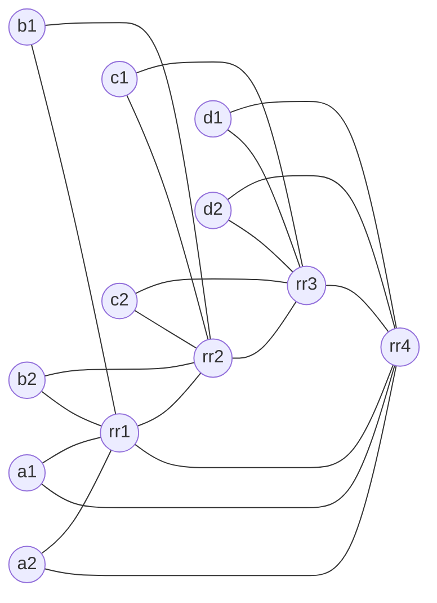

# BGP ORR with 4 Regional RR Clusters (cRPD + containerlab)

This lab demonstrates BGP Optimal Route Reflection (ORR) with four regional route reflector (RR) clusters. Each cluster has two clients. The topology uses iBGP everywhere and IS-IS as the underlay IGP. ORR is configured per region using `optimal-route-reflection` with `igp-primary` and `igp-backup`.

The key idea is to show how ORR lets an RR select a best path based on the IGP view of a client location, not the RR's own IGP perspective.

## Topology summary

- 4 regions: A, B, C, D
- 4 RRs: `rr1`–`rr4`
- 8 clients: `a1 a2 b1 b2 c1 c2 d1 d2`
- iBGP between each RR and its two clients
- iBGP full mesh between RRs
- IS-IS L2 across all nodes
- ORR enabled on each RR for its regional client group

Clients are dual-homed into the IGP (to their regional RR and the adjacent RR) to create different IGP viewpoints between the RR and the client group. This allows ORR to actually change the chosen egress for a shared prefix.

## Topology diagram



## What ORR does in this lab

Two clients originate the same prefix `198.51.100.0/24`:

- `c1` (Region C)
- `d1` (Region D)

Without ORR, `rr1` would select the best path based on its own IGP distances. With ORR enabled and the `igp-primary` set to `a1`, `rr1` selects the best path based on `a1`'s IGP view. Because `a1` is closer (IGP-wise) to Region D in this lab, ORR causes `rr1` to reflect the `d1` path to its clients, even though `rr1` itself is closer to `c1`.

## ORR fundamentals (quick refresher)

- ORR improves RR path selection by using a client's IGP view instead of the RR's local IGP view.
- ORR is enabled per BGP peer group with `optimal-route-reflection`.
- A client group should share similar IGP topology.
- You set one client as `igp-primary` and optionally an `igp-backup`.
- ORR only works when the BGP next-hop is resolved in the IGP (inet.0), not when MPLS/LDP/RSVP resolves the next-hop.

## Files

- `bgp-orr-4rr.clab.yml`: containerlab topology
- `configs/`: startup configs for each node

## Prereqs

1. Linux host with Docker installed
2. containerlab installed
3. cRPD image loaded into Docker

This lab uses `crpd:24.2R1.14` in the topology file. If you have a newer stable tag, update the `image:` field in `bgp-orr-4rr.clab.yml`.

## cRPD interface and IS-IS notes (important)

These are cRPD-specific behaviors that will break IS-IS if you use Junos/vMX-style config:

- Data-plane interfaces are `eth1`, `eth2`, ... (not `ge-0/0/x`).
- IS-IS is configured on the parent interface, not a unit:
  - `set protocols isis interface eth1 point-to-point`
  - `set protocols isis interface eth1 level 2 metric 10`
- `family iso` is not supported on `eth*` in this cRPD build. Only keep the NET under `protocols isis net` and `lo0.0` passive.

If you see no IS-IS adjacencies, first confirm you are not using `ethX.0` in IS-IS or `family iso` on `eth*`.

## Deploy

```bash
sudo containerlab deploy -t bgp-orr-4rr.clab.yml
```

Check that all nodes are running:

```bash
containerlab inspect -t bgp-orr-4rr.clab.yml
```

## Validate IGP

On any node (example `rr1`):

```bash
docker exec -it clab-bgp-orr-4rr-rr1 cli
show isis adjacency
show route protocol isis
```

## Validate BGP

On `rr1`:

```bash
show bgp summary
show bgp group CLIENTS
show route 198.51.100.0/24 detail
```

On `a1`:

```bash
show route 198.51.100.0/24 detail
```

You should see that the chosen next-hop for `198.51.100.0/24` aligns with `d1` when ORR is enabled.

## ORR verification commands

On `rr1`:

```bash
show configuration protocols bgp group CLIENTS | display set
show isis database detail | match "a1|d1|c1"
```

## Demonstration: ORR on vs off

1. Capture current best path on `a1`:

```bash
show route 198.51.100.0/24 detail
```

2. Disable ORR on `rr1`:

```bash
configure
deactivate protocols bgp group CLIENTS optimal-route-reflection
commit and-quit
```

3. Re-check on `a1`:

```bash
show route 198.51.100.0/24 detail
```

4. Re-enable ORR on `rr1`:

```bash
configure
activate protocols bgp group CLIENTS optimal-route-reflection
commit and-quit
```

## Addressing plan

### Loopbacks

- RRs: `10.0.0.1/32`–`10.0.0.4/32`
- Clients: `10.0.1.1/32`–`10.0.1.32/32`

### P2P links

All P2P links use `/31` under `172.16.0.0/24`. See `configs/` for exact mapping.

## Design notes

- RRs use `optimal-route-reflection` with `igp-primary` and `igp-backup` per region.
- IS-IS metrics are asymmetrical in the RR ring to ensure client vs RR IGP viewpoints differ.
- iBGP uses loopback addresses and relies on IS-IS for reachability.

## Cleanup

```bash
sudo containerlab destroy -t bgp-orr-4rr.clab.yml
```
